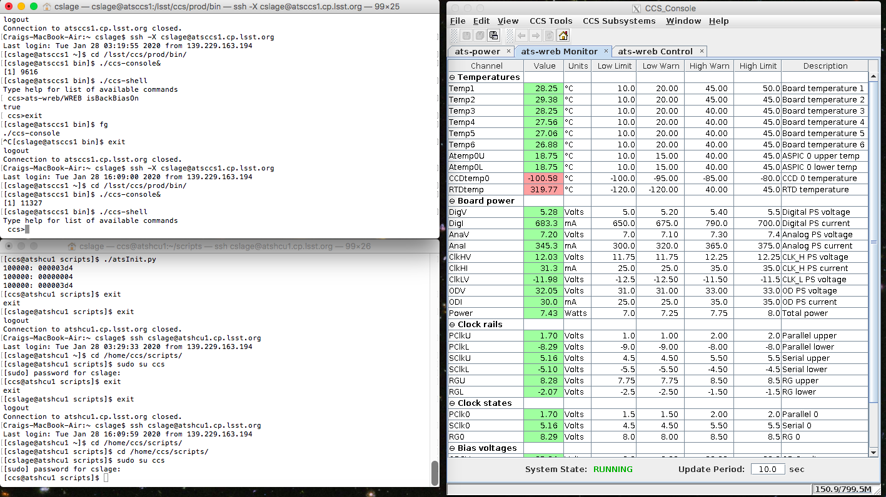

.. raw:: latex

   \vspace{-15mm}

.. raw:: latex

   \maketitle

.. raw:: latex

   \vspace{-5mm}

Introduction
============

The AuxTel CCD has been successfully operated at Cerro Pachon and is
taking astronomical spectra and images.  This document details
the power-up and power-down sequences to make sure the CCD operates.
This assumes that you are operating within the LSST-WAP network at Cerro
Pachon or in La Serena, although this can be run from outside using VPN.

Getting Started
===============

There are several options for controlling the CCD, but the procedure I
have been following is to open three screens, as follows:

-  Login to atsccs1, using ssh -X -Y yourname@atsccs1.cp.lsst.org

-  On this machine, cd to /lsst/ccs/prod/bin

-  Then launch the ccs-console, using ./ccs-console&

-  The ccs-console should then appear in an X-window. You will need to
   launch three tabs in the CCS_Subsystems pull down menu:

   -  ats-power

   -  ats-wreb Monitor

   -  ats-wreb Control

-  Then launch the ccs-shell, using ./ccs-shell

-  Login to atshcu1, using ssh yourname@atshcu1.cp.lsst.org

-  On this machine, cd to /home/ccs/scripts

-  In order to run the power up and power down scripts, you will need to
   include /lsst/ccs/prod/bin in your path; (e.g. export ). You might
   want to add this to your .bashrc file. These scripts should run from
   your account. If they don’t, you will need to either logout and log
   back in as ccs@atshcu1, or if you have sudo privileges, transfer to
   the ccs login using the command: sudo su ccs.

Your screen should now look something like this, and you are ready to
begin powering up the WREB and the CCD.

Powering up from a completely cold state
========================================

Assuming you are powering up the CCD from a completely cold state where
all power is off, run the following commands:

-  In the ccs-console ats-power tab:

   -  Turn Fan on

   -  Turn OTM on

   -  Turn Seq. Power on

   -  In the atshcu1 screen, run ./atsInit.py

This command should run, and the CCD should power up successfully. Check
that PClk0 is equal to PClkU. If it is not, stop and review the situation.  Suggested
resources are Tony Johnson, Patrick Ingraham or Craig Lage.  Then:

-  In atsccs1 ccs-shell run: R00/RebW setBackBias true

-  In the ccs-console ats-power tab, Turn HV Bias On.

Note that both of these steps must be performed to turn on the HV bias.
The CCD should now be powered up and ready to run.

Powering up the CCD when Seq Power is already on
================================================

If the Seq Power is already on, then we know the WREB is still in the
state where the parallel clocks are enabled. In this case, all that is
required to power up the CCD is the following:

-  In the atshcu1 screen, run ./atsInit.py

This command should run, and the CCD should power up successfully. Check
that PClk0 is equal to PClkU.  If it is not, stop and review the situation.  Suggested
resources are Tony Johnson, Patrick Ingraham or Craig Lage.  Then:

-  In atsccs1 ccs-shell run: R00/RebW setBackBias true

-  In the ccs-console ats-power tab, Turn HV Bias On.

Note that both of these steps must be performed to turn on the HV bias.
The CCD should now be powered up and ready to run.

Powering down the CCD, leaving Seq Power on
===========================================

To power down the CCD, leaving the WREB Seq Power on, do the following
steps. This should be the normal sequence for powering down the CCD:

-  In atsccs1 ccs-shell run: R00/RebW setBackBias false

-  In the ccs-console ats-power tab, Turn HV Bias Off.

-  In atsccs1 ccs-shell run: R00/RebW powerCCDsOff

-  In the ccs-console ats-power tab, Turn DPHI Off.

The CCD is now powered down, but the WREB is still powered up.

Powering down completely
========================

If, for some reason, you want to completely power down the entire
camera, do the following steps after completing the above section.
Note that if you then want to power upafter this, you need to follow the
“Powering up from a completely cold state” section above.

-  In the atshcu1 screen, run ./atsOff.py

The system should now be completely off.

.. raw:: latex

   \clearpage

