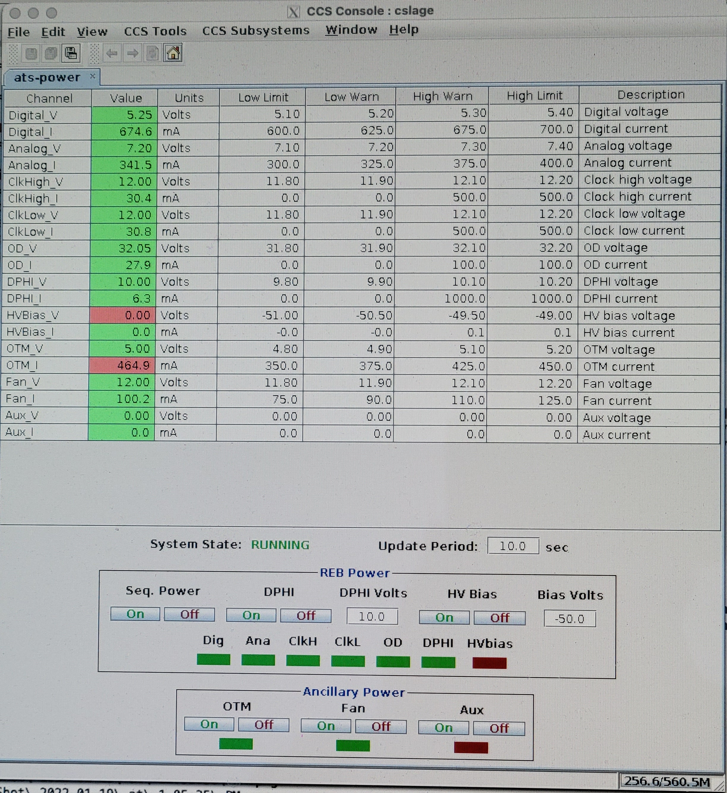

.. raw:: latex

   \vspace{-15mm}

.. raw:: latex

   \maketitle

.. raw:: latex

   \vspace{-5mm}

Introduction
========================================

The AuxTel CCD has been successfully operated at Cerro Pachon and is
taking astronomical spectra and images.  This document details
the power-up and power-down sequences to make sure the CCD operates.
This assumes that you are operating within the LSST-WAP network at Cerro
Pachon or in La Serena, although this can be run from outside using VPN.

Getting Started
========================================

The first step is to make sure the CCD power supplies are on and set to the correct voltages.
The necessary power supplies are shown in this image.  At a minimum, the three CCD power supplies, the
back-bias supply, and the atshcu1 computer all need to be powered on.

	   
These images show the correct voltages on the three CCD power supplies, each of which provides
three voltages.  This power is supplied to the WREB board, the OTM board, and the fan.  The
power is then regulated by the WREB board before being applied to the CCD.

.. image:: ./_static/Power_Supply_1.jpeg
.. image:: ./_static/Power_Supply_2.jpeg

	   
Once you have verified that these are powered up and have the correct voltages,
you can proceed to the next step.

Setting up the necessary connections
========================================

There are several options for controlling the CCD, but the procedure I
have been following is to open three screens, as follows:

-  Login to atsccs1, using ssh -X -Y yourname@atsccs1.cp.lsst.org

-  On this machine, cd to /lsst/ccs/prod/bin

-  Then launch the ccs-console, using ./ccs-console&

-  The ccs-console should then appear in an X-window. You will need to
   launch the ats-power tab in the CCS_Subsystems pull down menu.

-  Then launch the ccs-shell, using ./ccs-shell

-  Login to atshcu1, using ssh yourname@atshcu1.cp.lsst.org

-  On this machine, cd to /home/ccs/scripts

-  In order to run the power up and power down scripts, you will need to
   include /lsst/ccs/prod/bin in your path; (e.g. export ). You might
   want to add this to your .bashrc file. These scripts should run from
   your account. If they don’t, you will need to either logout and log
   back in as ccs@atshcu1, or if you have sudo privileges, transfer to
   the ccs login using the command: sudo su ccs.

Your screen should now look something like this, and you are ready to
begin powering up the WREB and the CCD.

.. image:: ./_static/Screens.png

	   
A closer view of the ats-power screen is shown here:

	   
Powering up from a completely cold state
========================================

Assuming you are powering up the CCD from a completely cold state where
all power is off, run the following commands:

-  In the ccs-console ats-power tab:

   -  Turn Fan on

   -  Turn OTM on

   -  Turn Seq. Power on

It is possible to take an image at this point, even though the CCD is not powered up yet.
What this image should look like is shown in the next section.
      
   -  In the atshcu1 screen, run ./atsInit.py

This command should run, and the CCD should power up successfully. Check
that PClk0 is equal to PClkU. If it is not, stop and review the situation.  Suggested
resources are Tony Johnson, Patrick Ingraham or Craig Lage.  Then:

It is suggested to take some images at this point to make sure everything is connected,
before turning on the HV bias.  Representative images are in the next section.

Once you are satisfied with the images, you can turn on the HV bias.  This should not be
done unless the CCD is cold.  To turn on the HV bias, run the following steps:

-  In atsccs1 ccs-shell run: R00/RebW setBackBias true

-  In the ccs-console ats-power tab, Turn HV Bias On.

Note that both of these steps must be performed to turn on the HV bias.
The CCD should now be powered up and ready to run.

Representative images during power up.
========================================

If you take an image before running atsInit.py, the CCD is not really on
and connected, so you are just reading out noise.  However, this is useful to verify that
images are being taken and stored.  An image at this point should look somthing like this:

Images taken while the CCD is warm and without back-bias can look
quite ugly.  Here are some representative images to compare with:

.. image:: ./_static/Warm_NoBB_2s_Dark_20210519.png
.. image:: ./_static/Warm_NoBB_5s_Dark_20220119.png   

	   

Powering up the CCD when Seq Power is already on
================================================

If the Seq Power is already on, then we know the WREB is still in the
state where the parallel clocks are enabled. In this case, all that is
required to power up the CCD is the following:

-  In the atshcu1 screen, run ./atsInit.py

This command should run, and the CCD should power up successfully. Check
that PClk0 is equal to PClkU.  If it is not, stop and review the situation.  Suggested
resources are Tony Johnson, Patrick Ingraham or Craig Lage.  Then:

-  In atsccs1 ccs-shell run: R00/RebW setBackBias true

-  In the ccs-console ats-power tab, Turn HV Bias On.

Note that both of these steps must be performed to turn on the HV bias.
The CCD should now be powered up and ready to run.

Powering down the CCD, leaving Seq Power on
===========================================

To power down the CCD, leaving the WREB Seq Power on, do the following
steps. This should be the normal sequence for powering down the CCD:

-  In atsccs1 ccs-shell run: R00/RebW setBackBias false

-  In the ccs-console ats-power tab, Turn HV Bias Off.

-  In atsccs1 ccs-shell run: R00/RebW powerCCDsOff

-  In the ccs-console ats-power tab, Turn DPHI Off.

The CCD is now powered down, but the WREB is still powered up.

Powering down completely
========================

If, for some reason, you want to completely power down the entire
camera, do the following steps after completing the above section.
Note that if you then want to power up after this, you need to follow the
“Powering up from a completely cold state” section above.

-  In the atshcu1 screen, run ./atsOff.py

The system should now be completely off.

.. raw:: latex

   \clearpage

